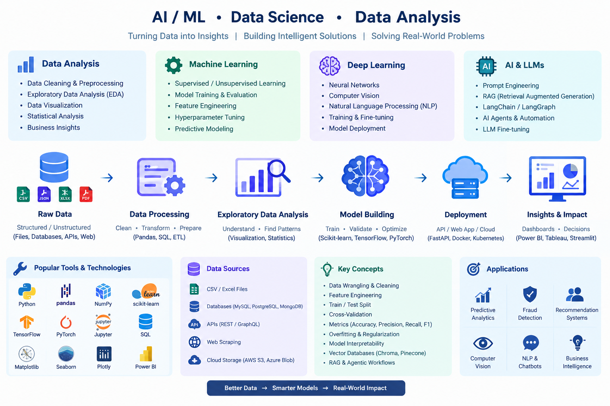

generate a image for the ai /ml ds , data analysis and so on 

Edit

Edited image
generate a professional readme file for this also

Creating image

generate the file not image 

Done. I created a professional README.md covering AI/ML, Data Science, Data Analysis, Deep Learning, Generative AI, RAG, tools, workflow, project structure, evaluation metrics, and applications.

 

Library
/
README_AI_ML_Data_Science.md

AI / ML, Data Science & Data Analysis

  

 <b>Turning Data into Insights • Building Intelligent Solutions • Solving Real-World Problems</b> 

Overview
This repository is a practical learning and project space covering the core areas of Data Analysis, Machine Learning, Deep Learning, Data Science, and Generative AI.

The goal is to understand the complete data-to-intelligence workflow — from collecting and cleaning raw data to exploratory analysis, model development, evaluation, deployment, and AI-powered applications.

Raw Data
   ↓
Data Cleaning & Preprocessing
   ↓
Exploratory Data Analysis (EDA)
   ↓
Feature Engineering
   ↓
Model Building
   ↓
Training & Evaluation
   ↓
Deployment
   ↓
Insights / Predictions / AI Applications
Areas Covered
Area	Key Topics
Data Analysis	Data Cleaning, EDA, Statistics, Visualization, Business Insights
Machine Learning	Supervised Learning, Unsupervised Learning, Classification, Regression, Clustering
Deep Learning	Neural Networks, Computer Vision, NLP, Training & Fine-Tuning
Data Science	Data Wrangling, Feature Engineering, Statistical Analysis, Predictive Modeling
AI & LLMs	Prompt Engineering, RAG, LangChain, LangGraph, AI Agents
Data Visualization	Matplotlib, Seaborn, Plotly, Power BI
Data Engineering Basics	SQL, ETL, APIs, Databases, Cloud Storage
Deployment	FastAPI, Docker, Kubernetes, Cloud Platforms
Data Analysis
Data analysis focuses on transforming raw data into meaningful information and actionable insights.

Workflow
Collect data from files, databases, APIs, or other sources.

Inspect the dataset and understand its structure.

Handle missing, duplicate, and inconsistent values.

Transform and normalize data when required.

Perform Exploratory Data Analysis (EDA).

Visualize patterns, distributions, and relationships.

Apply statistical analysis.

Extract useful business or technical insights.

Common Tools
Python

Pandas

NumPy

SQL

Matplotlib

Seaborn

Plotly

Power BI

Machine Learning
Machine Learning enables systems to learn patterns from historical data and make predictions or decisions.

Supervised Learning
Used when the dataset contains known target labels.

Examples:

Classification

Regression

Common algorithms:

Linear Regression

Logistic Regression

Decision Tree

Random Forest

K-Nearest Neighbors

Support Vector Machine

Gradient Boosting

Unsupervised Learning
Used when target labels are not available.

Examples:

K-Means Clustering

Hierarchical Clustering

Dimensionality Reduction

Principal Component Analysis (PCA)

Deep Learning
Deep Learning uses neural networks with multiple layers to learn complex patterns.

Major Areas
Artificial Neural Networks

Computer Vision

Natural Language Processing

Image Classification

Object Detection

Text Classification

Speech and Language Applications

Common frameworks:

TensorFlow

PyTorch

AI & Large Language Models
The AI section focuses on modern LLM-based application development.

Topics
Tokens and Context Windows

Temperature and Top-P

Prompt Engineering

Embeddings

Vector Databases

Retrieval-Augmented Generation (RAG)

Function Calling

AI Agents

Multi-Agent Workflows

LangChain

LangGraph

LangSmith

LLM Fine-Tuning

RAG Architecture
Documents
    ↓
Document Loading
    ↓
Text Splitting / Chunking
    ↓
Embeddings
    ↓
Vector Database
    ↓
User Query
    ↓
Similarity / Hybrid Search
    ↓
Relevant Context
    ↓
LLM
    ↓
Grounded Response + Citations
Development vector database examples:

ChromaDB

Pinecone

Production-oriented options:

PostgreSQL + pgvector

Managed vector databases

Core Technologies
Programming
Python
SQL
JavaScript / TypeScript
Data & ML
Pandas
NumPy
Scikit-learn
TensorFlow
PyTorch
Visualization
Matplotlib
Seaborn
Plotly
Power BI
Databases
PostgreSQL
MySQL
MongoDB
Redis
ChromaDB
Pinecone
AI Engineering
LLMs
Embeddings
RAG
LangChain
LangGraph
LangSmith
AI Agents
Backend & Deployment
FastAPI
Node.js
Express.js
Docker
Kubernetes
Cloud Platforms
Repository Structure
ai-ml-data-science/
│
├── data/
│   ├── raw/
│   ├── processed/
│   └── external/
│
├── data-analysis/
│   ├── data-cleaning/
│   ├── eda/
│   ├── statistics/
│   └── visualization/
│
├── machine-learning/
│   ├── classification/
│   ├── regression/
│   ├── clustering/
│   └── model-evaluation/
│
├── deep-learning/
│   ├── neural-networks/
│   ├── computer-vision/
│   └── nlp/
│
├── generative-ai/
│   ├── prompting/
│   ├── embeddings/
│   ├── rag/
│   ├── agents/
│   └── llm-applications/
│
├── notebooks/
│
├── projects/
│
├── requirements.txt
│
└── README.md
Model Evaluation
Different problems require different evaluation metrics.

Problem	Common Metrics
Classification	Accuracy, Precision, Recall, F1-Score
Regression	MAE, MSE, RMSE, R²
Clustering	Silhouette Score, Davies-Bouldin Index
Retrieval	Precision@K, Recall@K, MRR
LLM Applications	Groundedness, Relevance, Faithfulness, Retrieval Quality
For imbalanced classification problems, accuracy alone can be misleading. Precision, recall, F1-score, confusion matrices, and appropriate threshold analysis should also be considered.

Applications
The concepts in this repository can be applied to:

Fraud Detection

Recommendation Systems

Predictive Analytics

Customer Analytics

Business Intelligence

Computer Vision

NLP Applications

AI Chatbots

Enterprise Knowledge Assistants

Document Intelligence

Cybersecurity Analytics

Forecasting

Anomaly Detection

Learning Approach
The recommended progression is:

Python
  ↓
NumPy + Pandas
  ↓
SQL
  ↓
Statistics & Probability
  ↓
Data Cleaning
  ↓
EDA + Visualization
  ↓
Scikit-learn
  ↓
Machine Learning
  ↓
Deep Learning Fundamentals
  ↓
LLMs + Embeddings
  ↓
RAG
  ↓
LangChain / LangGraph
  ↓
AI Agents
  ↓
FastAPI + Docker
  ↓
Production AI Applications
Example Projects
Potential projects that can be developed using these concepts:

Titanic Survival Prediction

Student Performance Analysis

Sales Data Dashboard

Customer Churn Prediction

Credit Card Fraud Detection

Recommendation System

Sentiment Analysis

Image Classification

AI Document Q&A System

Enterprise RAG Knowledge Assistant

AI-Powered Cybersecurity Analytics

Multi-Agent Research Assistant

Engineering Principles
This repository emphasizes practical engineering rather than only theoretical model building.

Key principles:

Clean and reproducible data pipelines

Meaningful exploratory analysis

Appropriate model selection

Proper train/test validation

Explainable evaluation metrics

API-based model serving

Containerized deployments

Secure authentication and authorization

Monitoring and observability

Scalable architecture

Production-ready AI workflows

Goal
The ultimate goal is to move beyond simply training models and learn how to build complete, production-oriented data and AI systems.

Better Data
     ↓
Better Analysis
     ↓
Smarter Models
     ↓
Reliable AI Systems
     ↓
Real-World Impact

 <b>AI / ML • Data Science • Data Analysis • Generative AI</b> 

 Building practical knowledge from data to intelligent applications. 

